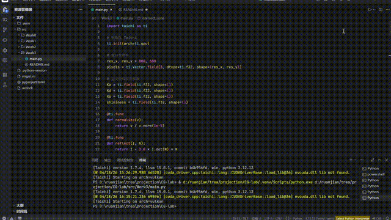

# 第四次作业
202411081058
易相宇
## 效果演示



## 项目架构

本项目采用模块化设计，主要包含以下文件：

- `src/Work3/main.py`：项目主入口，实现光线追踪和 Phong 光照模型

## 代码逻辑

1. **初始化**：
   - 使用 Taichi 库初始化 GPU 环境
   - 声明像素缓冲区和材质参数
   - 创建窗口和画布

2. **光线追踪**：
   - 生成相机光线
   - 测试光线与几何体（球体和圆锥）的相交
   - 计算交点和法线

3. **Phong 光照模型**：
   - 环境光计算
   - 漫反射计算
   - 镜面反射计算
   - 组合光照效果

4. **渲染**：
   - 并行计算每个像素的颜色
   - 将渲染结果绘制到画布
   - 提供材质参数调整界面

5. **用户交互**：
   - 实时调整材质参数（环境光、漫反射、镜面反射、高光系数）

## 实现功能

- **光线追踪**：实现光线与球体和圆锥的相交测试
- **Phong 光照模型**：完整实现环境光、漫反射和镜面反射
- **实时渲染**：使用 GPU 并行计算，实现流畅渲染
- **材质参数调整**：通过 GUI 界面实时调整材质属性
- **3D 场景**：包含两个几何体（红球和紫色圆锥）

## 技术特点

1. **GPU 加速**：利用 Taichi 的 GPU 后端实现并行计算
2. **光线追踪算法**：实现球体和圆锥的光线相交测试
3. **Phong 光照模型**：实现完整的光照计算
4. **实时交互**：提供材质参数调整界面
5. **内存优化**：使用 Taichi 的 Field 进行高效内存管理

## 运行方式

在项目根目录下运行：

```bash
python src/Work3/main.py
```

运行后会弹出一个窗口，显示带有 Phong 光照效果的 3D 场景。右侧控制面板可以调整材质参数：
- **Ka (Ambient)**：环境光系数
- **Kd (Diffuse)**：漫反射系数
- **Ks (Specular)**：镜面反射系数
- **N (Shininess)**：高光系数

场景中包含一个红色球体（左侧）和一个紫色圆锥（右侧），它们会根据光照和材质参数的变化实时更新渲染效果。
